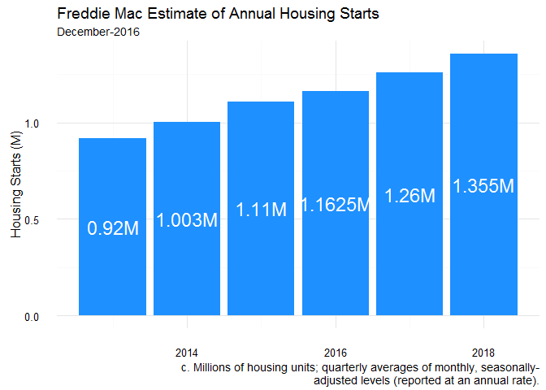
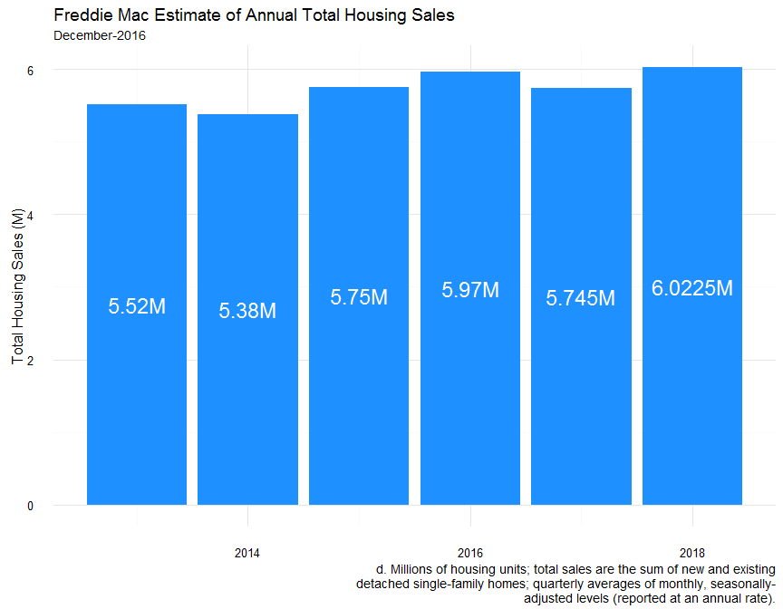
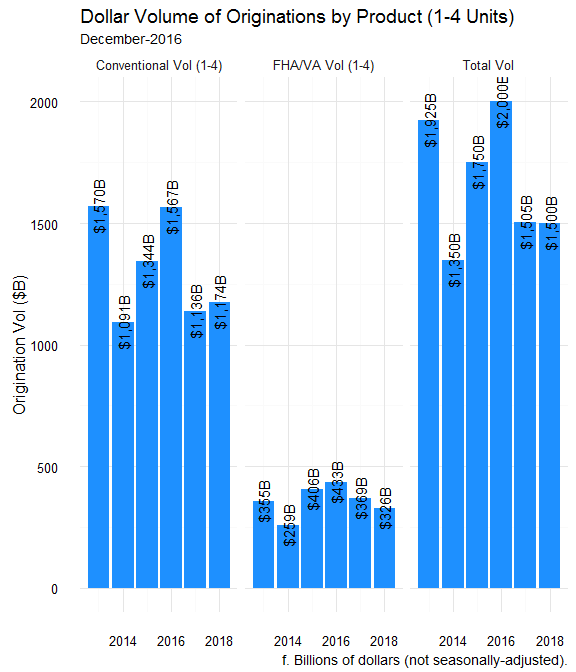
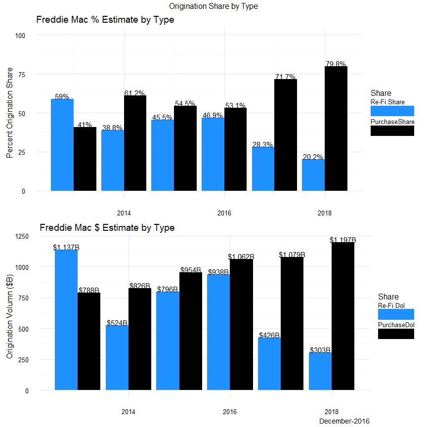

# FRE_HOUSING_ESTIMATES
Stuart_Quinn  
`r format(Sys.Date(),'%B-%Y')`  


#Data Source
Housing market graphical overview of data provided by Freddie Mac. The data is taken from the monthly reports updated by the Freddie Mac team of economists. For our purposes, we have removed the component data used to model the forecasts. All of the data is readily available [here][1]. You will need to follow the links until you find the "Forecast Table," which is provided in Excel format. That is the file we will be downloaded and modifying for analysis. 


```r
#Get URL of report 
######################################################
#This Data is updated monthly and the link will change
#######################################################
url <- 'http://www.freddiemac.com/finance/docs/december_2016_public.xls'

#Set temp folder
temp <- tempfile()
#Download excel spreadsheet
d <- download.file(url, temp, mode = 'wb')

#Make sure the file has the desired extension type, .xls in this case 
```

```
## [1] TRUE
```

```r
#Read the dataset in
d <- read_excel(paste0(temp, '.xls'), skip = 5)
```

```
## DEFINEDNAME: 00 00 00 0d 07 00 00 00 01 00 00 00 00 00 00 50 72 69 6e 74 5f 41 72 65 61 5f 4d 49 3c 01 00 2f 00 2f 00 
## DEFINEDNAME: 00 00 00 0d 07 00 00 00 00 00 00 00 00 00 00 50 72 69 6e 74 5f 41 72 65 61 5f 4d 49 3a 00 00 2c 00 0e 00 
## DEFINEDNAME: 00 00 00 0d 07 00 00 00 01 00 00 00 00 00 00 50 72 69 6e 74 5f 41 72 65 61 5f 4d 49 3c 01 00 2f 00 2f 00 
## DEFINEDNAME: 00 00 00 0d 07 00 00 00 00 00 00 00 00 00 00 50 72 69 6e 74 5f 41 72 65 61 5f 4d 49 3a 00 00 2c 00 0e 00 
## DEFINEDNAME: 00 00 00 0d 07 00 00 00 01 00 00 00 00 00 00 50 72 69 6e 74 5f 41 72 65 61 5f 4d 49 3c 01 00 2f 00 2f 00 
## DEFINEDNAME: 00 00 00 0d 07 00 00 00 00 00 00 00 00 00 00 50 72 69 6e 74 5f 41 72 65 61 5f 4d 49 3a 00 00 2c 00 0e 00 
## DEFINEDNAME: 00 00 00 0d 07 00 00 00 01 00 00 00 00 00 00 50 72 69 6e 74 5f 41 72 65 61 5f 4d 49 3c 01 00 2f 00 2f 00 
## DEFINEDNAME: 00 00 00 0d 07 00 00 00 00 00 00 00 00 00 00 50 72 69 6e 74 5f 41 72 65 61 5f 4d 49 3a 00 00 2c 00 0e 00
```

```r
#Function to suppress DEFINEDNAME output -- need to add

#https://github.com/hadley/readxl/issues/82#issuecomment-166767220
```


#Clean Data

```r
###############################CLEAN DATA######################

#Remove the notes from the bottom of the file for reference
notes <- d[c(21:30), 1]

#Subset data to get rid of macro-indicators used to forecast
d1 <- d[-c(2:10, 20:nrow(d)),]

#Split out the annual data from the quarterly forecast info
d_annual <- d1[,c(1,10:ncol(d1))]
#Set column names to annual
colnames(d_annual) <- d_annual[1,]
#Remove additional placeholders
d_annual <- d_annual[-c(1,5),]

#Rename all of the indicators to a more understandable titles

d_annual$Indicator <- c('Housing Starts', 'Tot Home Sales (Incl Condos)', 'FRE HPI', 
                         'Conventional Vol (1-4)', 'FHA/VA Vol (1-4)', 'Total Vol', 
                        'Re-Fi Share','Mtg Debt Pct')

#Transpose data into a better format
d_annual_t <- data.frame(t(d_annual), stringsAsFactors = F)
#Rename the column headers from the first row
colnames(d_annual_t) <- d_annual_t[1,]
#Drop the row that is now a header
d_annual_t <- d_annual_t[-1,]
#Create a year column since it is currently the row.names
d_annual_t$year <- row.names(d_annual_t)
#Convert from char to numeric to create new measures
d_annual_t <- sapply(d_annual_t, as.numeric)
#Convert to data.frame for ease of use
d_annual_t <- as.data.frame(d_annual_t, row.names = NULL)

#Generate new measures based on existing data: Purchase Share and $ volumes of share
d_annual_t$PurchaseShare <- round((100-d_annual_t$`Re-Fi Share`),2)
d_annual_t$`Re-Fi Dol` <- (d_annual_t$`Re-Fi Share`/100)*d_annual_t$`Total Vol`
d_annual_t$PurchaseDol <- (d_annual_t$PurchaseShare/100)*d_annual_t$`Total Vol`

#Convert wide data to long for plotting
####THIS WILL BE USED TO CREATE ALL OF OUR PLOTTING DATA
d_annual_long <- melt(d_annual_t, id.vars = 'year')
```

#Subset Data for Plots

We will evaluate the following metrics as defined by Freddie Mac, the [National Association of Realtors][2] and the [U.S. Census Bureau][3]

1. *Housing Starts:* Millions of housing units, seasonally-adjusted reported as annual rate (SAAR). Start of construction occurs when excavation begins for the footings or foundation of a building. All housing units in a multifamily building are defined as being started when this excavation begins. Beginning with data for September 1992, estimates of housing starts include units in structures being totally rebuilt on an existing foundation.
2. *Total  Home Sales (Incl Condos):* Millions of housing units, the sum of new and existing detached single-family homes reported as a SAAR. 

3. *1-4 Family Mortgage Originations:* Mortgage originations for 1-4 unit residential properties broken down by loan-purpose (purchase/re-finance) and loan-type (FHA/VA or Conventional).


```r
###########################DATA SUBSETS FOR GRAPHING###################

#Housing Starts -- Total Including Condos
h_starts <- d_annual_long%>%
  filter(grepl('Starts', variable))
#
h_sales <- d_annual_long%>%
  filter(grepl('Home Sales', variable))

orig_vol <- d_annual_long%>%
  filter(grepl('Vol', variable))

purch_refi <- d_annual_long%>%
  filter(grepl('Re-Fi', variable) |
         grepl('Purchase', variable))

m_share <- purch_refi%>%filter(grepl('Share', variable))
m_dol <- purch_refi%>%filter(grepl('Dol', variable))
```

#Plots

##Housing Starts



##Total Sales (Incl Condos)



##Origination by Investor



##Origination by Loan Type




```r
sessionInfo()
```

```
## R version 3.2.3 (2015-12-10)
## Platform: x86_64-w64-mingw32/x64 (64-bit)
## Running under: Windows >= 8 x64 (build 9200)
## 
## locale:
## [1] LC_COLLATE=English_United States.1252 
## [2] LC_CTYPE=English_United States.1252   
## [3] LC_MONETARY=English_United States.1252
## [4] LC_NUMERIC=C                          
## [5] LC_TIME=English_United States.1252    
## 
## attached base packages:
## [1] stats     graphics  grDevices utils     datasets  methods   base     
## 
## other attached packages:
##  [1] rmarkdown_0.9.6    knitr_1.12         gridExtra_2.2.1   
##  [4] stringr_1.1.0      rvest_0.3.1        xml2_0.1.2        
##  [7] dplyr_0.5.0        ggplot2_2.1.0.9000 reshape2_1.4.1    
## [10] readxl_0.1.1      
## 
## loaded via a namespace (and not attached):
##  [1] Rcpp_0.12.5       magrittr_1.5      munsell_0.4.3    
##  [4] colorspace_1.2-6  R6_2.1.2          httr_1.0.0       
##  [7] plyr_1.8.4        tools_3.2.3       grid_3.2.3       
## [10] gtable_0.2.0      DBI_0.4-1         htmltools_0.3.5  
## [13] yaml_2.1.13       lazyeval_0.1.10   assertthat_0.1   
## [16] digest_0.6.10     tibble_1.1        formatR_1.2.1    
## [19] rsconnect_0.4.1.4 evaluate_0.8      labeling_0.3     
## [22] stringi_1.1.1     scales_0.4.0
```
[1]: http://www.freddiemac.com/finance/
[2]: https://www.nar.realtor/topics/existing-home-sales
[3]: https://www.census.gov/construction/nrc/definitions/index.html#start

