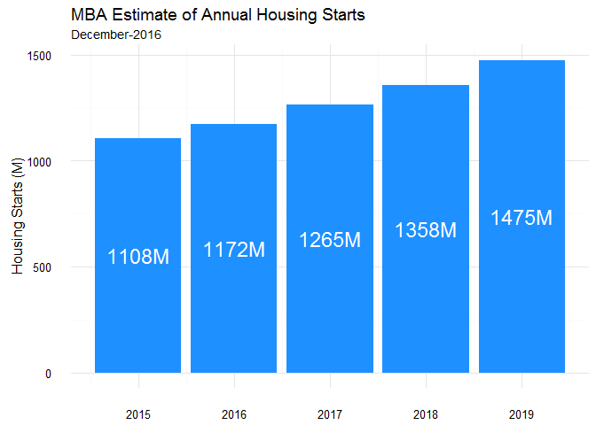
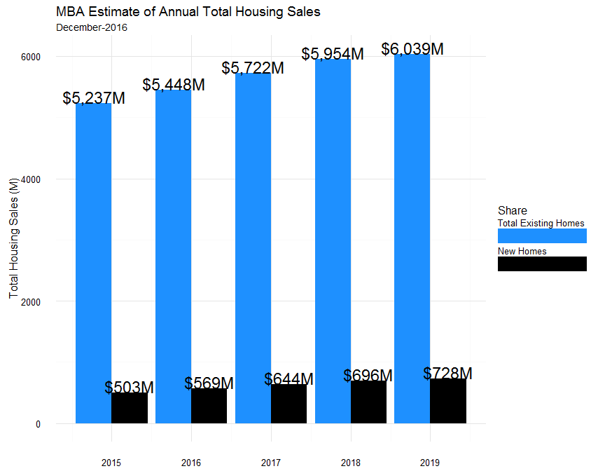
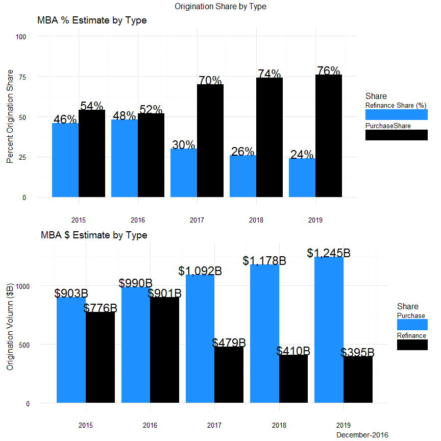

# MBA_HOUSING_ESTIMATES
Stuart_Quinn  
`r format(Sys.Date(),'%B-%Y')`  


#Data Source
Housing market graphical overview of data provided by the Mortgage Bankers Association (MBA). The data is taken from the monthly reports updated by the MBA team of researchers and economists. For our purposes, we have removed the majority of the component data used to model the forecasts. All of the data is readily available [here][1]. The data is hosted in .pdf format and will need to be converted into a machine-readable format for analysis. For our analysis, we use an open-source software called [Tabula][2].


```r
##################################
#NOTE
#This directs to a local file dir
#and assumes you have already
#downloaded the .pdf (Dec-2016)
#for this analysis
################################

################################GET DATA########################

#Set the path to the downloaded .pdf file
#Extract the tables from the .pdf path (read-in data)
out <- extract_tables(path2pdf)
#Convert the page into a data.frame
d1 <- as.data.frame(out[[1]])
```


#Clean Data

```r
###############################CLEAN DATA######################
#Remove all of the unneccessary quarterly data
d_annual <- d1[,-c(2:13)]
#Rename the columns
colnames(d_annual) <- c('variables', '2015', '2016', '2017', '2018', '2019')
#Remove uncessary rows (metrics)
d_annual_clean <- d_annual[-c(1:2,6,9:15),]

#Transpose the data
d_annual_t <- data.frame(t(d_annual_clean), stringsAsFactors = F)
#Add column names back 
colnames(d_annual_t) <- d_annual_t[1,]
#Remove the top row that is now redundant now that you have applied to the col names
d_annual_t <- d_annual_t[-1,]

#Create a new Year Field
d_annual_t$year <- row.names(d_annual_t)

#Remove all spaces present from importing
d_annual_t$`Refinance Share (%) ` <- gsub('\\s', '',d_annual_t$`Refinance Share (%) `)

#Removes all commas that are present as characters in the dataset sep 1000s fields
#Convert to numeric values
d_annual_t[] <- lapply(d_annual_t, function(x) as.numeric(gsub('\\,', '', as.character(x))))

d_annual_t <- as.data.frame(d_annual_t, row.names = NULL)

#Calculate fields
d_annual_t$PurchaseShare <- 100 - d_annual_t$`Refinance Share (%) `
d_annual_t$TotalHomeSales <- d_annual_t$`Total Existing Homes `+ d_annual_t$`New Homes `

#Convert into a long dataset
d_annual_long <- melt(d_annual_t, id.vars = 'year')
```

#Subset Data for Plots

We will evaluate the following metrics as defined by the MBA, the [National Association of Realtors][3] and the [U.S. Census Bureau][4]

1. *Housing Starts:* Millions of housing units, seasonally-adjusted reported as annual rate (SAAR). Start of construction occurs when excavation begins for the footings or foundation of a building. All housing units in a multifamily building are defined as being started when this excavation begins. Beginning with data for September 1992, estimates of housing starts include units in structures being totally rebuilt on an existing foundation.
2. *Total  Home Sales (Incl Condos):* Millions of housing units, the sum of new and existing detached single-family homes reported as a SAAR. 

3. *1-4 Family Mortgage Originations:* Mortgage originations for 1-4 unit residential properties broken down by loan-purpose (purchase/re-finance) 


```r
###########################DATA SUBSETS FOR GRAPHING###################
h_starts <- d_annual_long%>%
  filter(grepl('Starts', variable))

h_sales <- d_annual_long%>%
  filter(grepl('Total Existing', variable)|
         grepl('New Homes', variable))

purch_refi <- d_annual_long%>%
  filter(grepl('Refinance', variable) |
           grepl('Purchase', variable))

m_share <- purch_refi%>%filter(grepl('Share', variable))
m_dol <- purch_refi%>%filter(!grepl('Share', variable))
```

#Plots

##Housing Starts



##Total Sales (Incl Condos)



##Origination by Loan Type



[1]: https://www.mba.org/news-research-and-resources/research-and-economics/forecasts-and-commentary/mortgage-finance-forecast-archives
[2]: http://tabula.technology/
[3]: https://www.nar.realtor/topics/existing-home-sales
[4]: https://www.census.gov/construction/nrc/definitions/index.html#start
